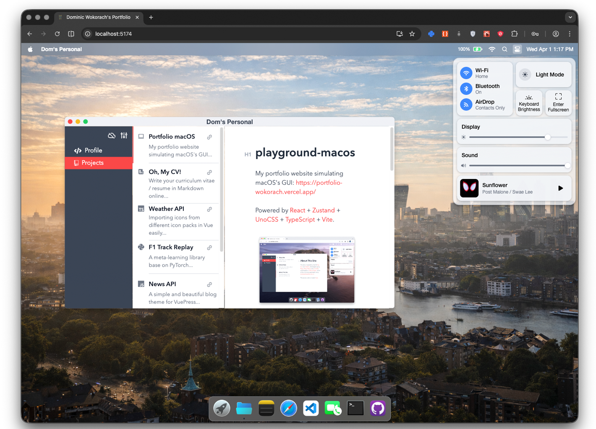
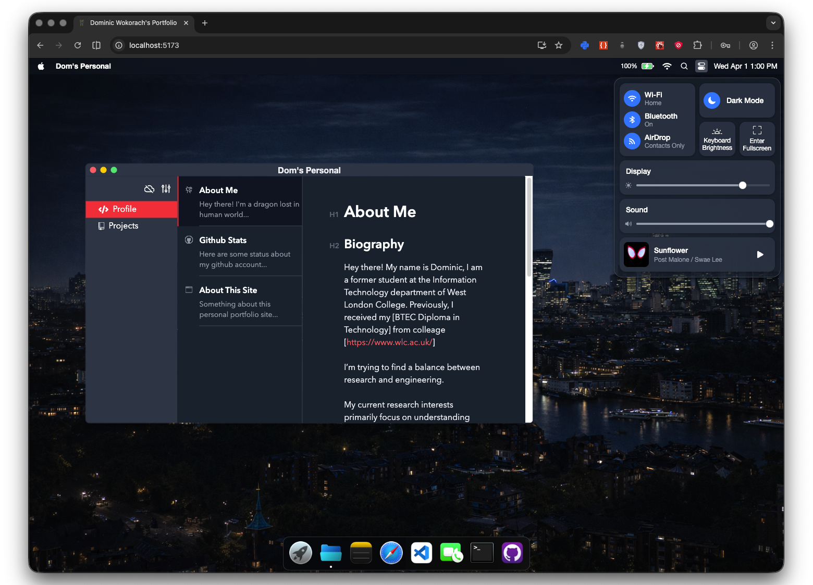

# Portfolio-Wokorach

My portfolio website simulating macOS's GUI: https://portfolio-wokorach.vercel.app/




&nbsp;

## Usage

Clone the repo and install dependencies:

```bash
pnpm install
```

Start dev server (with hot reloading):

```bash
pnpm dev
```

Build for production with minification to the `dist` folder:

```bash
pnpm build
```

## Changelog

- **Update 2026.01.26**: Improve [FaceTime](https://support.apple.com/en-us/HT208176).

- **Update 2026.01.05**: Simulated the device's actual battery state using [Battery API](https://developer.mozilla.org/en-US/docs/Web/API/Battery_Status_API), displaying 100% charge on [unsupported browsers](https://developer.mozilla.org/en-US/docs/Web/API/Battery_Status_API#browser_compatibility).


## License

[MIT](MIT)